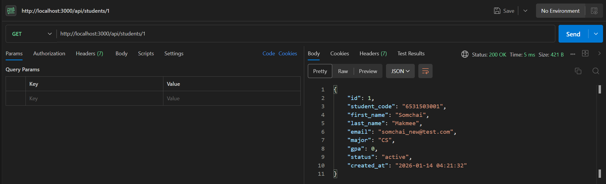
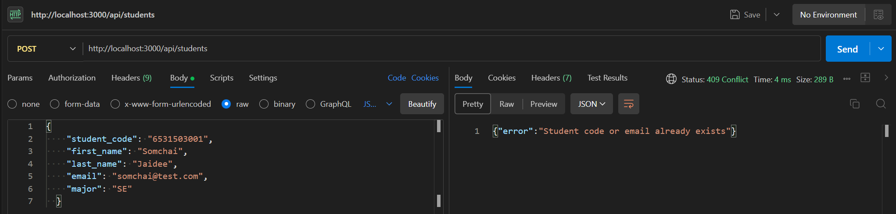
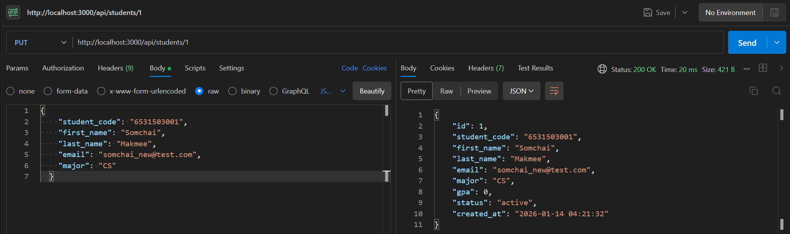
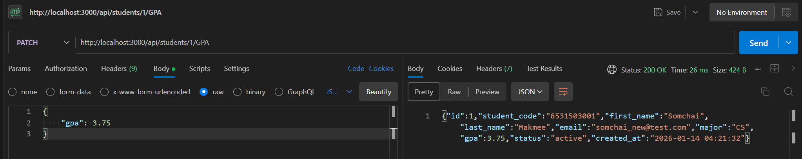
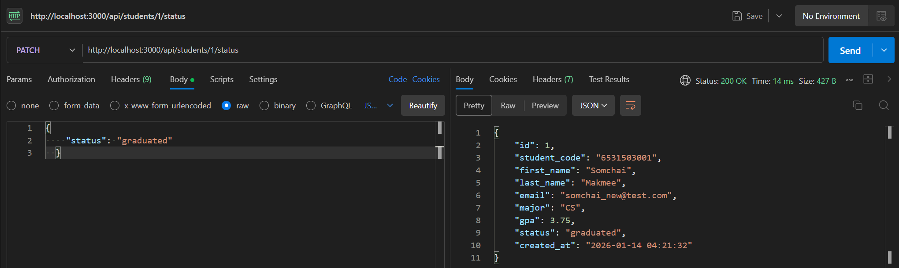

# Student Management System - Layered Architecture

## 📋 Project Information
- **Student Name:** [ธนกร ผดุงศิลป์]
- **Student ID:** [67543210030-2]
- **Course:** ENGSE207 Software Architecture

## 🏗️ Architecture Style
Layered Architecture (3-tier)

## 📂 Project Structure
midterm-individual/
├── src/
│   ├── presentation/      # Layer 1: Presentation (Routes, Controllers, Middlewares)
│   ├── business/          # Layer 2: Business Logic (Services, Validators)
│   └── data/              # Layer 3: Data Access (Repositories, Database)
├── server.js              # Entry point
├── package.json           # Dependencies
├── students.db            # SQLite Database
└── README.md              # Documentation

## 🎯 Refactoring Summary

### ปัญหาของ Monolithic (เดิม):
1. **High Coupling:** โค้ดส่วน Database, Validation และ Logic ปนกันมั่วในไฟล์เดียว ทำให้แก้ไขยาก
2. **Hard to Maintain:** เมื่อระบบใหญ่ขึ้น ไฟล์ server.js จะยาวมากจนดูแลไม่ไหว
3. **Hard to Test:** ไม่สามารถทดสอบแยกส่วน (Unit Test) เฉพาะ Logic หรือ Database ได้
4. **Code Duplication:** มีการเขียน Logic ตรวจสอบข้อมูลซ้ำซ้อนในหลายจุด

### วิธีแก้ไขด้วย Layered Architecture:
1. **Presentation Layer:** แยกส่วนรับ Request/Response ออกมา ไม่ให้รู้เรื่อง Database
2. **Business Layer:** รวม Logic การตรวจสอบเงื่อนไขทางธุรกิจไว้ที่เดียว (Services & Validators)
3. **Data Layer:** แยกการเขียน SQL Query ออกมาจัดการต่างหาก (Repositories)

### ประโยชน์ที่ได้รับ:
1. **Separation of Concerns:** แต่ละ Layer มีหน้าที่ชัดเจน ลดความซับซ้อน
2. **Reusability:** Business Logic สามารถถูกเรียกใช้ซ้ำได้จากหลายจุด
3. **Scalability:** สามารถขยายระบบ แก้ไข Database หรือเปลี่ยน Framework ได้ง่ายขึ้นโดยไม่กระทบส่วนอื่น

## 🚀 How to Run
```bash
# 1. Clone repository (หากดาวน์โหลดมาแล้วข้ามขั้นตอนนี้)
git clone [https://github.com/thanakon17/midterm-individual-67543210030-2]

# 2. Install dependencies
npm install

# 3. Run server
npm start

# 4. Test API
# Open browser: http://localhost:3000/api/students
## 📝 API Endpoints

### 1. Get All Students (ดึงข้อมูลนักศึกษาทั้งหมด)
- **URL:** `/api/students`
- **Method:** `GET`
- **Query Params (Optional):**
  - `major` (Ex: `?major=CS`)
  - `status` (Ex: `?status=active`)
- **Success Response:** `200 OK`


### 2. Get Student by ID (ดึงข้อมูลนักศึกษารายคน)
- **URL:** `/api/students/:id`
- **Method:** `GET`
- **Example:** `/api/students/1`
- **Success Response:** `200 OK`


### 3. Create Student (เพิ่มนักศึกษาใหม่)
- **URL:** `/api/students`
- **Method:** `POST`
- **Success Response:** `201 Created`
- **Body (JSON):**
  ```json
  {
    "student_code": "6531503001",
    "first_name": "Somchai",
    "last_name": "Jaidee",
    "email": "somchai@test.com",
    "major": "SE"
  }
  ```


### 4. Update Student Info (แก้ไขข้อมูลส่วนตัว)
- **URL:** `/api/students/:id`
- **Method:** `PUT`
- **Success Response:** `200 OK`
- **Body (JSON):**
  ```json
  {
    "student_code": "6531503001",
    "first_name": "Somchai",
    "last_name": "Makmee",
    "email": "somchai_new@test.com",
    "major": "CS"
  }
  ```


### 5. Update GPA (อัปเดตเกรดเฉลี่ย)
- **URL:** `/api/students/:id/gpa`
- **Method:** `PATCH`
- **Success Response:** `200 OK`
- **Body (JSON):**
  - **Range:** 0.00 - 4.00
  ```json
  {
    "gpa": 3.75
  }
  ```


### 6. Update Status (อัปเดตสถานะการเรียน)
- **URL:** `/api/students/:id/status`
- **Method:** `PATCH`
- **Success Response:** `200 OK`
- **Body (JSON):**
  - **Allowed Values:** `active`, `graduated`, `suspended`, `withdrawn`
  ```json
  {
    "status": "graduated"
  }
  ```


### 7. Delete Student (ลบข้อมูลนักศึกษา)
- **URL:** `/api/students/:id`
- **Method:** `DELETE`
- **Success Response:** `200 OK`
- **Condition:** Cannot delete student with `active` status.
